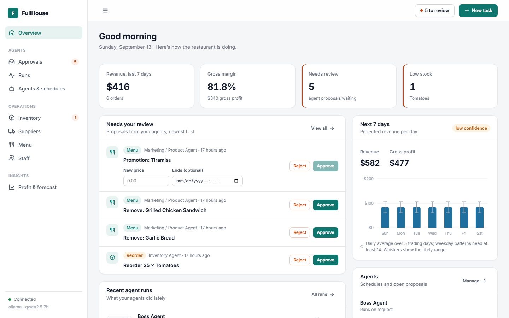
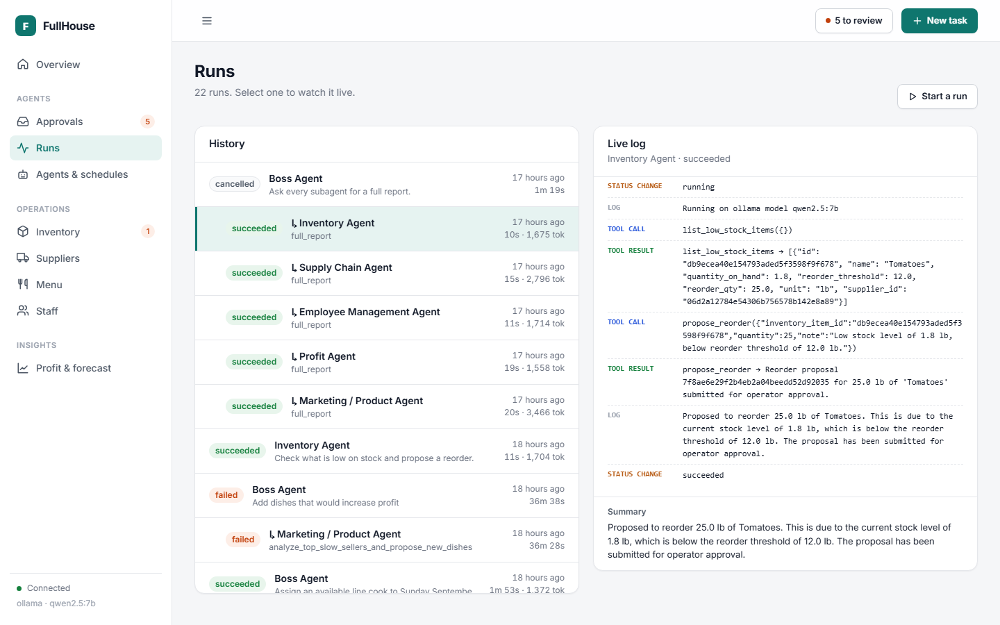
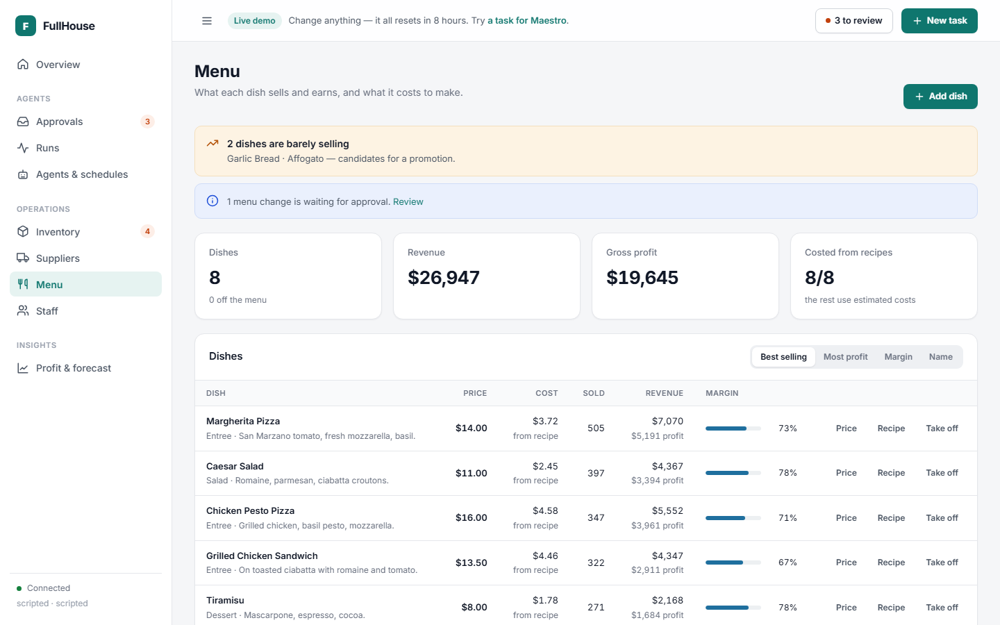
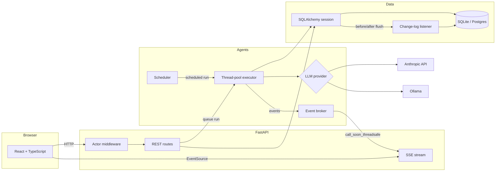

# FullHouse

**An operations platform for a restaurant, run by a team of AI agents that propose — and a manager who decides.**

A Boss agent delegates to five specialists (inventory, suppliers, staff, menu, profit). Each can read the restaurant's
real data and propose changes: reorder stock, schedule a shift, run a promotion. Nothing takes effect until a person
approves it, every change is recorded with who made it and why, and anything can be reverted.

[](https://github.com/eddierzhang/FullHouse-Updated/actions/workflows/ci.yml)



| Watching an agent delegate, live | Menu costed from recipes |
|---|---|
|  |  |

---

## What it does

- **Agents that act, safely.** Agents call tools against live data and queue proposals. Approving one performs the real
  change in the same transaction as the approval and its audit record — so an approval can't succeed while its effect
  fails. Proposals missing information (a promotion described but never priced) ask for it before Approve is enabled.
- **A complete, revertible history.** Every insert, update and delete is captured with before/after values, the person
  or agent responsible, and the agent run behind it. Any change can be undone; the undo is recorded too.
- **Live agent runs.** Runs execute in the background and stream every tool call and result to the browser as it
  happens, including the Boss's delegation tree. Runs can be cancelled mid-flight.
- **Scheduled agents.** Cron schedules per agent, with a guard against overlapping runs. Promotions expire on their own.
- **Local or hosted models.** Swap between Anthropic's API and a local Ollama model with one setting.
- **Operations that add up.** Recipes link dishes to ingredients, so selling a dish draws down stock, food cost is
  computed rather than guessed, and "days of cover" compares real consumption against supplier lead times.
  Profit, margins and a seven-day revenue forecast come from actual sales, each labelled with how much data it rests on.

## Architecture



## Engineering notes

The decisions that took the most thought, and why:

**Change tracking lives in the ORM, not in the routes.** A session listener captures every write, so no code path —
a REST handler, an agent tool, a seed script — can change data unrecorded. Capture is split across two events: prior
values are read in `before_flush`, the only point they're still knowable, and inserts in `after_flush`, the only point
a new row has its primary key. SQLAlchemy's `active_history` has to be switched on, because a commit expires attributes
and the old value of a later edit would otherwise be silently recorded as null.
([listener.py](backend/app/audit/listener.py))

**Streaming crosses a thread boundary.** Agent runs use synchronous clients (SQLAlchemy, the Anthropic SDK, httpx), so
they run on a thread pool, while server-sent events are served on the asyncio loop. A small broker hops each event back
onto the loop with `call_soon_threadsafe`. Streams replay recorded events before going live, so a late listener still
sees the whole run. ([broker.py](backend/app/agents/broker.py))

**Cancellation is cooperative.** Providers check between tool rounds rather than killing a thread mid-write, and runs
orphaned by a server restart are marked failed on startup instead of claiming to be in progress forever.

**The Boss's subagents run in parallel.** When the Boss delegates to several specialists in one turn, they run
concurrently, so the turn takes as long as the slowest one rather than the sum. Only tools that opt in with
`parallel_safe` ever run concurrently: a SQLAlchemy session is not thread-safe, so each delegation opens its own, and a
lock serialises the sequence numbers of the events the Boss's run gets from several threads at once. A three-agent
review that files proposals takes about 74s against 134s of subagent time.
([orchestrator.py](backend/app/agents/orchestrator.py))

**Slow local runs were model reloads, not inference.** Profiling showed ~140 tokens/s and sub-second calls, but 10–16s
of load time on nearly every call: Ollama reloads a model whenever a request asks for a different context size than
the loaded copy, and unloads it after five idle minutes. Every request now pins `num_ctx` and `keep_alive`.

**Numbers say what they rest on.** The forecast switches from a daily average to weekday means only with two weeks of
history, and reports its confidence. "Days of cover" is blank, not zero, where no recipe links an item to sales.

**Timezones were a real bug.** The profit chart's daily series once summed to less than the headline revenue: days were
bucketed by local date while timestamps were stored in UTC. Everything is UTC now, and Postgres sessions are pinned to
`GMT` — which, unlike `UTC`, every Postgres build has without a timezone database.

## Agent evaluation

Six scenarios run each agent through the real pipeline against a throwaway database, then score what it *did*: which
tools it called, whether it made the right proposal, whether that proposal would actually apply (applied, then rolled
back), and — in two negative scenarios — whether it correctly did nothing.

| Scenario | `qwen3.5:4b` | `qwen2.5:7b` | do-nothing baseline |
|---|---|---|---|
| Stock shortage | 100% | 100% | 60% |
| Nothing low *(should propose nothing)* | 100% | 100% | 100% |
| Slow-selling dish | 80% | 80% | 40% |
| Purchase order from the right supplier | 100% | 40% | 60% |
| Cover a staffing gap | 100% | 20% | 60% |
| Profit report *(read-only)* | 100% | 100% | 100% |
| **Overall** | **97%** | **73%** | **70%** |

The baseline matters: an agent that never acts scores 70%, so that's the floor to beat. The smaller model beat the larger
one, which proposed orders and shifts for the wrong items. Both left prices off their promotions, which is why the
approval queue asks for them. One run per scenario, so treat small differences as noise.
Full report: [evals/results/latest.md](backend/evals/results/latest.md).

## Tech stack

**Backend** — Python 3.11, FastAPI, SQLAlchemy 2.0, Alembic, Pydantic v2, APScheduler, psycopg 3, Anthropic SDK, httpx
**Frontend** — React 19, TypeScript, Vite, hand-built SVG charts, no UI framework
**Data** — SQLite locally, Postgres supported and tested
**Models** — Anthropic Claude, or local models through Ollama
**Quality** — pytest (200 tests on SQLite and Postgres), Playwright end-to-end tests, agent evals, GitHub Actions
**Delivery** — Docker Compose with nginx

## Running it

### With Docker

```bash
cp .env.docker.example .env
docker compose up -d --build
```

Open http://localhost:8080. The first start downloads the model. See [DEPLOY.md](DEPLOY.md) for free cloud hosting.

### For development

```bash
# backend
cd backend
python -m venv .venv && .venv/Scripts/activate     # source .venv/bin/activate on macOS/Linux
pip install -r requirements-dev.txt
cp .env.example .env                               # set LLM_PROVIDER and a model
alembic upgrade head && python scripts/seed_data.py
uvicorn app.main:app --port 8000

# frontend, in another terminal
cd frontend
npm install
npm run dev                                        # http://localhost:5173
```

`LLM_PROVIDER` is `ollama` (needs [Ollama](https://ollama.com) and a tool-capable model), `anthropic` (needs
`ANTHROPIC_API_KEY`), or `scripted` — a deterministic, model-free provider for trying the app without either.

For Ollama, start the server with `OLLAMA_NUM_PARALLEL=4` so the Boss's parallel delegations aren't queued one at a
time, and don't share that server with other heavy workloads — a competing request for the same model with different
settings makes Ollama reload it.

### Tests

```bash
cd backend && python -m pytest                                  # unit and integration tests, SQLite
TEST_DATABASE_URL=postgresql://... python -m pytest             # the same suite against Postgres
python -m evals.run --targets ollama:qwen3.5:4b scripted        # agent evaluation
cd frontend && npx playwright test                              # end-to-end, starts its own isolated stack
```

## Project layout

```
backend/
  app/agents/       runner, executor, broker, scheduler, appliers, providers, tools
  app/audit/        change-log listener, actor context, revert
  app/restaurant/   domain models, aggregates (profit, forecast, supply chain), routes
  evals/            scenarios, harness, results
  tests/
frontend/
  src/pages/        one component per page
  src/components/   shared UI: approvals list, charts, drawer, recipe editor
  e2e/              Playwright tests
docker-compose.yml, DEPLOY.md
```

## Limitations

- **No authentication.** Anyone who can reach the app can approve, edit or revert, and the recorded actor is
  self-reported. Restrict access before exposing it (see [DEPLOY.md](DEPLOY.md)).
- **Single process.** The event broker and scheduler live in the API process, so it can't be scaled horizontally without
  moving them to something like Redis.
- **Gross, not net.** Profit excludes labour and overheads.
- **No purchase-order lifecycle.** Approving a reorder books the goods as received immediately.
